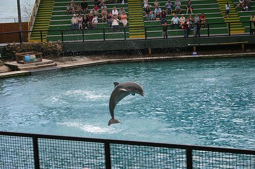

# Water Segmentation App

This project implements a water segmentation application using a UNet model trained on the [Water Segmentation Dataset](https://www.kaggle.com/datasets/gvclsu/water-segmentation-dataset/data). It includes a FastAPI backend for image segmentation and a simple frontend using HTML, CSS, and JS to visualize the results.

## Description
### Image example


The Water Segmentation App is a comprehensive tool designed to identify and segment water bodies in images using advanced machine learning techniques. The core of this application is built around a UNet model, a type of convolutional neural network optimized for image segmentation tasks. This model has been trained on the Water Segmentation Dataset, ensuring high accuracy and performance.

## Important Note

Please note that you need to train your own UNet model as this project does not include a pre-trained model. You can download it from [here](https://drive.google.com/file/d/1--q8rQFt8ibsePDO5T9GPHmdSguFbYOT/view?usp=sharing) 
or you can use the provided dataset and training scripts to train your model before deploying the application.

## Installation and Setup

### Getting Started

1. **Clone the Repository**
   ```bash
   git clone <repository-url>
   cd WaterSegmentationApp
   ```

2. **Configure Environment Variables**
   - Create a `.env` file based on `.env.example` and set necessary variables.

3. **Setting up trained model**
   - Add trained model to folder `./backend/models`

4. **Build and Run with Docker Compose**
   ```bash
   docker-compose up --build
   ```
   This command will build and start both the FastAPI backend and the frontend.

5. **Access the Application**
   - Open your browser and go to `http://localhost:9000` to access the web interface for segmentation.

## Structure of the Project

- **`backend/`**: Contains the FastAPI application for image segmentation.
- **`frontend/`**: Simple frontend for visualizing segmentation results.
- **`backend/model/`**: Trained UNet model and utilities for segmentation.
- **`docker-compose.yml`**: Configuration for Docker Compose setup.
- **`Water_segmentaion_model.ipynb`**: Colab notebook with model training process.

## Usage

### Backend API

- **Segment an Image**:
  - Endpoint: `/predict`
  - Method: `POST`
  - Body: Form-data with `image` file
  - Returns: Segmented image

### Frontend UI

- **Upload an Image**:
  - Simple UI for uploading images and displaying segmentation results.

